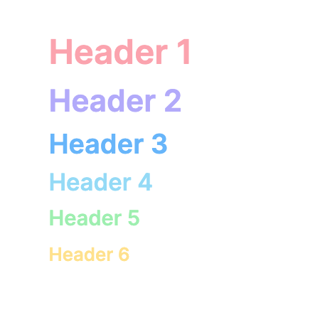
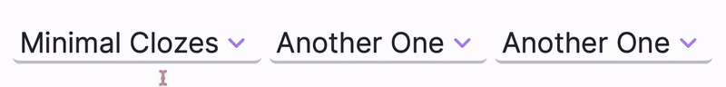
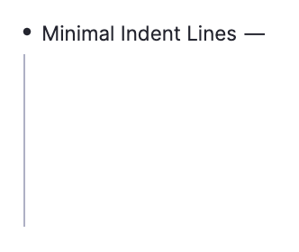
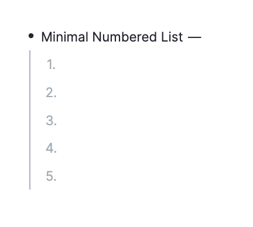
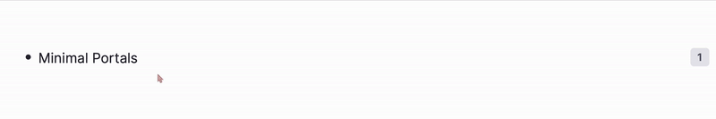
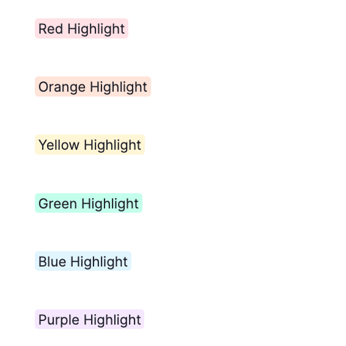
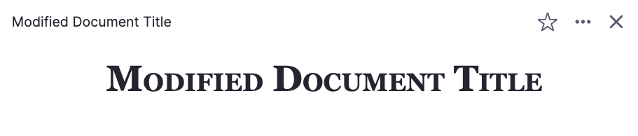
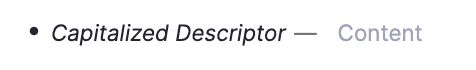
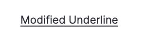
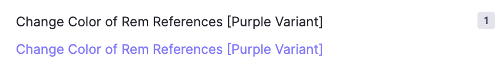

# CSS Snippets for RemNote by Anisha

**Documentation Status**
| Symbol | Interpretation |
| ------- | ------ 
| 🔌 | Converted to Plugin |
| ⚠️ | In Progress |
| 🆘 | Help Wanted |

---

<!-- Rainbow Headers -->
## 🔌 Rainbow Headers
```css
@import url("https://anishaaa1.github.io/remnote-css/css/rainbow-headers.css");
```

<details>
<summary>Notes</summary>

* Create these tags:
  * `H4` for Header 4
  * `H5` for Header 5
  * `H6` for Header 6

> ❗️Important as they are not native headers unlike Header 1, Header 2, and Header 3.

</details>

<details>
<summary>Preview</summary>
<br>

</details>

### 🆕 Updates
Rainbow Headers is now available as a 🔌 plugin!


Head to `Plugin Settings` to modify the appearance of your headers to your preference.


<br><br>
Once you have installed this plugin, you no longer need to keep this CSS snippet in Custom CSS as it may interfere with the plugin itself.

<!-- Minimal Clozes -->
## 🔌 Minimal Clozes
```css
@import url("https://anishaaa1.github.io/remnote-css/css/minimal-clozes.css");
```

<details>
<summary>Preview</summary>
<br>

</details>

### 🆕 Updates
Minimal Clozes is now available as a 🔌 plugin!


Head to `Plugin Settings` to modify the appearance of your clozes to your preference.


<br><br>
Once you have installed this plugin, you no longer need to keep this CSS snippet in Custom CSS as it may interfere with the plugin itself.

<!-- Custom PDF Pins & References  -->
## Custom PDF Pins & References
```css
@import url("https://anishaaa1.github.io/remnote-css/css/custom-pdf-pins-references.css");
```

<!-- Minimal Indent Lines -->
## Minimal Indent Lines
```css
@import url("https://anishaaa1.github.io/remnote-css/css/minimal-indent-lines.css");
```

<details>
<summary>Preview</summary>
<br>

</details>

<!-- Minimal Numbered List -->
## Minimal Numbered List
```css
@import url("https://anishaaa1.github.io/remnote-css/css/minimal-numbered-list.css");
```

<details>
<summary>Preview</summary>
<br>

</details>

<!-- Minimal Portals -->
## 🔌 Minimal Portals
```css
@import url("https://anishaaa1.github.io/remnote-css/css/minimal-portals.css");
```

<details>
<summary>Preview</summary>
<br>

</details>

## 🆕 Updates
Minimal Portals is now available as a 🔌 plugin!


Head to `Plugin Settings` to modify the appearance of your portals to your preference.


<br><br>
Once you have installed this plugin, you no longer need to keep this CSS snippet in Custom CSS as it may interfere with the plugin itself.

<!-- Rounded Highlights -->
## Rounded Highlights
```css
@import url("https://anishaaa1.github.io/remnote-css/css/rounded-highlights.css");
```

<details>
<summary>Preview</summary>
<br>

</details>

<!-- Modified Document Title -->
## Modified Document Title
```css
@import url("https://anishaaa1.github.io/remnote-css/css/modified-document-title.css");
```
<details>
<summary>Preview</summary>
<br>

</details>

<!-- Capitalized Descriptors -->
## Capitalized Descriptors
```css
@import url("https://anishaaa1.github.io/remnote-css/css/capitalized-descriptors.css");
```

<details>
<summary>Preview</summary>
<br>

</details>

<!-- Increased Text Underline Offset -->
## Increased Text Underline Offset
```css
@import url("https://anishaaa1.github.io/remnote-css/css/increased-text-underline-offset.css");
```

<details>
<summary>Preview</summary>
<br>

</details>

<!-- Change Color of Rem References -->
## Change Color of Rem References
```css
@import url("https://anishaaa1.github.io/remnote-css/css/colored-rem-references.css");
```

<details>
<summary>Preview</summary>
<br>

</details>
