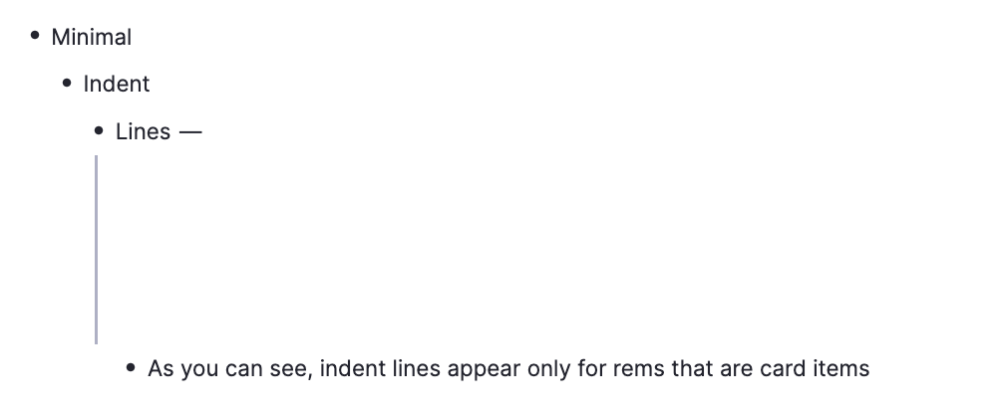

# CSS Snippets for RemNote by Anisha

**Documentation Status**
* ✅ Complete
* ⚠️ In Progress

**Additional Indicators**
* 🆘 Help Wanted

---

<!-- Rainbow Headers -->
## ✅ Rainbow Headers
```css
@import url("https://anishaaa1.github.io/remnote-css/css/rainbow-headers.css");
```

<details>
<summary>Notes</summary>

* Create these tags:
  * `H4` for Header 4
  * `H5` for Header 5
  * `H6` for Header 6

> ❗️Important as they are not native headers unlike Header 1, Header 2, and Header 3.

</details>

<details>
<summary>Preview</summary>
<br>

</details>

<!-- Minimal Clozes -->
## ✅ Minimal Clozes
```css
@import url("https://anishaaa1.github.io/remnote-css/css/minimal-clozes.css");
```

<details>
<summary>Preview</summary>
<br>

</details>

<!-- Minimal Indent Lines -->
## ✅ Minimal Indent Lines
```css
@import url("https://anishaaa1.github.io/remnote-css/css/minimal-indent-lines.css");
```

<details>
<summary>Preview</summary>
<br>

</details>

<!-- Minimal Numbered List -->
## ✅ Minimal Numbered List
```css
@import url("https://anishaaa1.github.io/remnote-css/css/minimal-numbered-list.css");
```

<details>
<summary>Preview</summary>
<br>

</details>

<!-- Minimal Portals | Notion-Style -->
## ✅ Minimal Portals | Notion-Style
```css
@import url("https://anishaaa1.github.io/remnote-css/css/minimal-portals.css");
```

<details>
<summary>🆘 Known Issues</summary>
<br>

* Transitions related to hovering in and out of portals glitch at times (**do not fade as intended**, instead, they cut).
  
</details>

<details>
<summary>Preview</summary>
<br>

</details>

<!-- Rounded Highlights -->
## ✅ Rounded Highlights
```css
@import url("https://anishaaa1.github.io/remnote-css/css/rounded-highlights.css");
```

<details>
<summary>Preview</summary>
<br>

</details>

<!-- Modified Document Title -->
## ✅ Modified Document Title
```css
@import url("https://anishaaa1.github.io/remnote-css/css/modified-document-title.css");
```
<details>
<summary>Preview</summary>
<br>

</details>

<!-- Capitalized Descriptors -->
## ✅ Capitalized Descriptors
```css
@import url("https://anishaaa1.github.io/remnote-css/css/capitalized-descriptors.css");
```

<details>
<summary>Preview</summary>
<br>

</details>

<!-- Increased Text Underline Offset -->
## ✅ Increased Text Underline Offset
```css
@import url("https://anishaaa1.github.io/remnote-css/css/increased-text-underline-offset.css");
```

<details>
<summary>Preview</summary>
<br>

</details>

<!-- Change Color of Rem References -->
## ✅ Change Color of Rem References
```css
@import url("https://anishaaa1.github.io/remnote-css/css/colored-rem-references.css");
```

<details>
<summary>Preview</summary>
<br>

</details>
